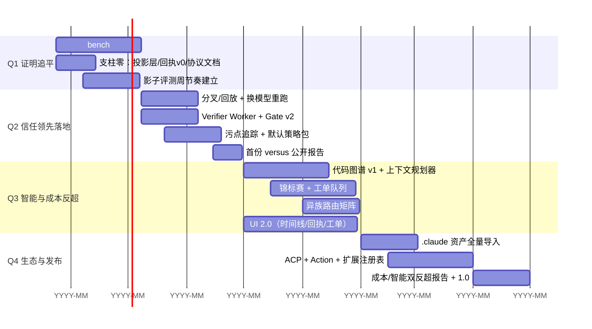

# DeepSeek Code 全面领先作战方案

> 姊妹篇：[NEXT_GEN_ARCHITECTURE.md](NEXT_GEN_ARCHITECTURE.md) 是架构真源（六大支柱），
> 本文档是**全战线作战方案**：架构之外的智能、手感、成本、生态四条战线，
> 以及让"碾压"可被公开验证的证据机。
>
> 写作纪律（沿用 README 传统）：先划清"能碾压"与"只能绕过"的边界，
> 每条战线都有量化碾压线，全部挂进 `benchmarks/` 体系，不达标不宣传。

---

## 0. 残酷的前提：三条不同的战线

"全方面碾压"如果理解成"每个维度都正面对攻并胜出"，是必输的——
对手是市值千倍于我们的公司。但如果正确地**选边、选轴、选武器**，
12 个月内可以做到：**在用户可感知的每一条产品轴上第一或并列第一**。

| 战线类别 | 包含轴 | 打法 |
| --- | --- | --- |
| **产品工程轴（可碾压）** | 信任/可验证性、恢复、成本、安全、手感、同模型智能 | 正面碾压，本文档主体 |
| **结构性轴（可绕过/中和）** | 对手实验室的模型调教、生态网络效应存量 | 绕过：同模型路由让对手模型为我所用；兼容层把对手生态变成我们的 |
| **非战场轴（不追）** | 自研模型、云 SaaS、全平台 | 明确放弃，资源集中于上面两线 |

### 0.1 四个核心洞察（全方案的地基）

**洞察一：同模型对照是 harness 优劣的唯一诚实度量。**
Claude Code 最强的护城河是"同一个 Claude 在它手里比在你手里聪明"。
这句话可以被证伪：**我们的 harness + Claude 模型 vs Claude Code + Claude 模型**，
同题、同机、同模型，比成功率/审批数/成本。赢了这个，调教神话就变成了工程问题——
而工程问题我们能赢。

**洞察二：BYOK 路由是被低估的结构性武器。**
Claude Code 永远只能用 Claude，Codex 永远只能用 OpenAI。
我们的路由矩阵可以**永远用当下最强的模型做执行，用不同族的模型做验证**——
新 SOTA 发布当天我们就部署，对手要等自己的实验室。
更关键的是：自验证的死穴是同族相关性盲区（Claude 验 Claude 会犯同样的错），
**异族验证**（GPT 验 Claude、DeepSeek 验 GPT）是只有 BYOK 架构能做的事。

**洞察三：生态打不过，就吸收。**
我们已经在做了：[skills.ts](src/core/skills.ts) 扫描 `.claude/skills/`，
[hooks.ts](src/core/hooks.ts) 兼容 `.claude/settings.json` 和 `PreToolUse` 写法。
把这条路做穿：用户为 Claude Code 积累的 skills/hooks/agents/配置，
在我们这里**零成本继续生效**——迁移成本归零，对手的生态存量变成我们的嫁衣。

**洞察四：碾压需要一台证据机。**
没有公开、可复现、第三方可验证的对照数据，"碾压"只是营销。
我们的回执机制（架构文档支柱二）恰好让**我们的成绩可以被密码学验证**——
这是对手给不出的举证方式，本身就是第二次差异化。

---

## 1. 战线 A：智能质量 —— 从"追平调教"到"harness 反超"

> 目标：同模型同题成功率 ≥ Claude Code，然后通过 harness 智能（验证回路、锦标赛、异族裁判）反超。

### A1 同模型对照基准台（`bench:versus`，最高优先级）

> **实施状态（2026-08-20）**：骨架已落地于 [benchmarks/versus/](benchmarks/versus/README.md)——
> 四个驱动器（deepseek / claude-code / codex / opencode）、16 题语料（bug_fix 12 /
> feature_add 2 / refactor 2，全部零外部依赖、命令可验证、双向校验"原始必挂/修复必过"）、
> harvest 汇总与 Markdown/JSON 报告（可 minisign 签名），`--check-corpus` 与
> `--self-test` 离线自检全绿。下一步：真实 issue 语料扩到 ≥60 题 + 接入 CI 周跑。
>
> **首跑实证（16 题 × 1 轮 × 两个模型族，2026-08-20）**：
>
> | 模型 | deepseek | claude-code |
> | --- | --- | --- |
> | kimi-k2.7-code | **16/16**，8.5K tok/成功，0 审批，16s | 15/16，15.0K tok，2.6 审批，47s |
> | deepseek-v4-pro | 15/16*，13.3K tok/成功，0 审批，17s | **16/16**，26.5K tok，4.0 审批，38s |
>
> \*vs-013 实为 harness 侧 turn 预算（8）过紧导致工作完成后被中断，非模型能力问题；
> 已修复为 16 并复跑通过。claude-code 在 kimi 上的唯一失败（vs-016）是 retry 语义
> off-by-one 且 headless 下无法自验、带错交付——同一失效模式连续两轮复现。
>
> **跨模型族稳定成立的信号**：token 成本为对手 50–57%、耗时约 1/2.5、审批打断 0 vs 2.6–4.0——
> 与成本战线（≤1/3 目标）和低打断目标（≤60%）方向一致；成功率双方互有单次失手，
> 需 ≥60 题语料与多轮复核才能下结论。首跑还抓出并修复了两个 harness 级缺陷：
> assistant tool_calls 配对（Moonshot/Anthropic 严格校验）与 turn 预算过紧。
>
> **Phase 0 地基已落地（2026-08-20）**：`src/core/session-projection.ts` 投影层
> （bun:sqlite / node:sqlite 双后端、随写随更、可整体重建），sidecar 启动初始化，
> Rust `list_sessions` / `usage_stats` 优先读投影、缺失自动退回 JSONL 扫描。

唯一诚实的度量台。技术方案：

```
benchmarks/versus/
  corpus/            # 同题语料 ≥ 60 题（真实修复/重构/研究任务，从 seeded-bug 与真实 issue 精选）
  drivers/
    deepseek.mjs     # 驱动我们的 sidecar（复用 runner.mjs 基建）
    claude-code.mjs  # claude -p --output-format stream-json，同模型同题
    codex.mjs        # codex exec（CLI headless 模式）
    opencode.mjs     # opencode run
  harvest.mjs        # 统一采集：成功率 / 审批次数 / input/output token / 墙钟 / 成本
  report.mjs         # 生成对照报告 + 签名回执
```

- **同模型纪律**：所有被测 harness 配同一模型端点（如都用 claude-sonnet 或都用 deepseek-chat），
  差值就是纯 harness 差距。
- **任务真实**：从开源仓库真实 issue 构造（带金标准补丁与测试），
  混入现有 64 fixture 族防过拟合。
- **每周自动跑**，结果进 `benchmarks/results/versus/<date>/`，
  `BenchmarkReleaseGate` 新增门槛：同模型成功率不得连续两周落后。

### A2 异族模型路由矩阵

配置（项目级，进 git，可审计）：

```jsonc
// .deepseek/models.json
{
  "roles": {
    "fast":      { "protocol": "openai-compatible", "baseURL": "...", "model": "deepseek-chat" },
    "executor":  { "protocol": "anthropic-messages", "baseURL": "...", "model": "claude-sonnet-x" },
    "planner":   { "inherits": "executor" },
    "verifier":  { "protocol": "openai-compatible", "baseURL": "...", "model": "gpt-x-pro" },
    "judge":     { "inherits": "verifier" }
  },
  "diversityRule": "verifier 与 executor 不得同族"   // 路由层强制，违反即启动报错
}
```

实现点：[main.ts](apps/deepseek-agent-runtime/src/main.ts) 的 `streamModel()` 目前只有
主/快两档（`fastModel`）；扩展为按角色解析客户端（`createProviderClient` 已有协议分支，
改动是机械性的）。Verifier Worker（支柱二）与 Judge（支柱三）强制走 `verifier` 角色。

**这条战线只有我们能做**：对手的产品被锁定在自己的模型族，
"Executor 用 Claude、Verifier 用 GPT"在 Claude Code 里是架构上不可能的。

### A3 影子评测周节奏（调教工业化）

- 一切 prompt、工具描述、系统指令、上下文策略改动：**先在 shadow 语料（支柱一回放 + versus 语料）
  跑赢基线才允许合入**。工具描述也是 prompt，纳入 A/B。
- `bench:shadow` 输出固定四格：成功率 / token / 缓存命中 / 审批数，PR 模板强制填写。
- 周节奏：每周一次"调教 PR"，只许动提示层，必须附 shadow 报告。
  这就是把对手"手感玄学"变成我们"周更工程"的方式。

### A4 回执验证语料 —— 别人没有的数据资产

竞品的遥测只知道"用户接没接受"；我们的回执知道"**验证器证明了没有**"。
回执即带金标签的训练/评测数据：

- 本地聚合（opt-in，脱敏纪律沿用现有 `redactSecrets`），
  形成路由/分类/验证器的持续评测集。
- 远期：蒸馏本地路由小模型（fast 角色的本地化），把分类成本打到零。

---

## 2. 战线 B：手感 —— 把"工程严谨"翻译成"用起来爽"

> 残酷现状：[main.tsx](apps/deepseek-code-desktop/src/main.tsx) 是 400 行单文件。
> Claude Code 的手感是它真正的护城河之一。这条战线的投入强度必须配得上野心。

### B1 延迟预算（硬指标，进 CI）

| 指标 | 预算 | 手段 |
| --- | --- | --- |
| 首 Token 时间（TTFT） | < 2s | 前缀缓存稳定（支柱四）、快速模型接管分类 |
| 热项目首个工具动作 | < 5s | 图谱预热（会话启动即后台索引）、MCP 连接池常驻 |
| 会话切换恢复 | < 300ms | 支柱一投影层（替代全量扫 JSONL） |
| 审批 → 续跑 | < 1s | 现有精确续跑链路，只差度量 |

### B2 UI 2.0 组件清单

| 组件 | 说明 | 差异化 |
| --- | --- | --- |
| 会话时间线 | 对话 + 工具 + 事件混排，每条消息带"⑂ 分叉" | 竞品无分叉 |
| Diff 视图 + 检查点回滚 | apply_patch 检查点已有，缺 UI | 一键回到任意检查点 |
| Evidence Inspector | 折叠的完整工具输出/Citation/截图 | 对话干净，证据一查到底 |
| 回执查看器 | 交付回执可视化 + "验证此回执"按钮 | 独有 |
| 工单面板 | 支柱三异步任务的状态板 | Codex 有任务列表但无本地审计链 |
| 流式 Markdown | 代码块高亮、增量渲染 | 手感基线 |

### B3 零打断默认值（在安全边界内）

- 项目级**审批记忆**：同一项目、同一命令模式、L2 以下的审批，
  用户选"本项目内不再询问"后落 `.deepseek/policy.json`（进 git，团队共享，可审计）。
  L3/L4 永远问——**低打断的边界不变，变的是重复确认的次数**。
- 支持批量审批（一次审批一组同类操作）。

### B4 CLI/TUI 对等体验

pi 和 OpenCode 的用户住在终端里。现有 `bin/deepseek.mjs` 只有
doctor/ask/session——扩展为完整 TUI（复用 sidecar 协议，不做第二套 agent 逻辑），
并让 TUI 与 GUI **共享同一份会话与回执**：上午在终端开工，下午在 App 里接着审。

---

## 3. 战线 C：成本 —— 每个已解决任务花多少钱

> BYOK 用户的每一分钱都是自己掏的。"同样修好这个 bug，我们便宜 3 倍"
> 是最朴素也最有杀伤力的碾压。

- **Headline 指标**：`cost-per-solved-task`（成功任务均摊 token 成本），
  直接进 [score.mjs](benchmarks/score.mjs) 输出与 versus 报告。
- **杠杆与目标**：
  - 代码图谱（支柱四）：探索类任务 token ↓ ≥ 40%。
  - 前缀缓存纪律：多轮会话缓存命中率 ≥ 60%。
  - 快速模型路由：分类/短答/摘要不碰主模型。
  - 锦标赛成本上限：超过预算自动降级为单跑。
  - **总目标：同模型同题成本 ≤ Claude Code 的 1/3**（versus 台度量）。
- 成本透明本身就是手感：用量面板（刚做完的 `usage_stats`）升级为
  "这个任务花了多少钱、缓存省了多少"。

---

## 4. 战线 D：生态吸收 —— 兼容即战争

> 不跟 Anthropic 的生态对攻（必输），把它变成我们的供给。

### D1 `.claude/` 资产全量导入（把已有兼容做穿）

| 对手资产 | 现状 | 动作 |
| --- | --- | --- |
| `.claude/skills/*/SKILL.md` | ✅ 已扫描（skills.ts） | 保持；补 `.claude/commands/` 旧格式 → slash skill |
| `.claude/settings.json` hooks | ✅ 已兼容（hooks.ts，含 PreToolUse 写法） | 补 matcher 语义（按工具名过滤） |
| `CLAUDE.md` / `AGENTS.md` | 部分 | `loadProjectInstructions` 增加兼容读取优先级链 |
| `.claude/agents/*.md` | 无 | 导入器 → 我们的 Worker 类型/sub-session 模板 |
| MCP `.mcp.json` | ✅ 已支持 | 保持对齐 Claude Code 的配置格式 |
| Claude Code 会话导出 | 无 | 远期：transcript → 我们的 JSONL 事件（让历史可回放） |

### D2 协议与渠道

- ACP 适配器（架构文档支柱六）：Zed 等编辑器免费接入。
- GitHub Action：`deepseek-code/action` 在 PR 上留**带签名回执的 review 评论**——
  对标 Codex review bot，但评论里的每个结论可离线验证。
- 扩展注册表（Q4）：第三方扩展发布时必须附带 CI 回执——
  **"已验证扩展"是我们注册表独有的信任等级**，对手的插件市场给不了。

### D3 迁移叙事

《从 Claude Code 迁移》一页指南：skills/hooks/CLAUDE.md 零改动生效 +
设置导入命令（`deepseek migrate --from-claude`）+ 你会额外得到什么（回执/回放/图谱）。
**让用户带着全部身家过来，来了还多拿三样东西。**

---

## 5. 证据机：让"碾压"可被第三方验证

1. **versus 公开报告**：每季度发布同模型对照结果（成功率/审批/成本/恢复率），
   原始事件日志与回执全部公开，任何人可复跑（runner 与语料开源）。
2. **可验证排行榜**：我们的每个数字带签名回执；对手的数字如实标注测量方法
   （"我们驱动其官方 CLI、同模型端点、脚本公开"）。诚实本身是差异化。
3. **安全社区首发**：污点追踪 + 注入拦截语料（`inj-*` fixture 族）先发技术文章——
   安全圈是最便宜、最可信的获客渠道。
4. **恢复率演示**：soak 测试（崩溃注入、SIGKILL、SSE 截断）做成一页可交互 demo——
   "杀死进程 100 次，0 次丢工作、0 次假造完成"。对手无法复刻这个演示，
   因为他们没有事件溯源内核。

---

## 6. 整合路线图（12 个月）



**停线纪律**：每个里程碑必须 `npm run bench && npm run bench:soak` 全绿 +
versus 不出现连续两周回退，否则冻结新功能先修地基。

---

## 7. 量化碾压线总表

| 战线 | 指标 | 碾压线 | 度量 |
| --- | --- | --- | --- |
| 信任 | delivered 带可验证回执 | 100% | Gate v2 强制 |
| 信任 | 崩溃恢复率 / 未知副作用重放 | 100% / 0 | soak（对手复刻不了） |
| 信任 | Verifier 拦截率 / 误拦率 | ≥70% / ≤10% | seeded-bug 语料 |
| 智能 | 同模型成功率 vs Claude Code | Q1 追平，Q3 +3pp | bench:versus |
| 智能 | 异族验证盲区削减 | 自验证漏检率 ↓50% | 对照实验（同族 vs 异族 verifier） |
| 手感 | TTFT / 首工具动作 / 会话切换 | <2s / <5s / <300ms | CI 延迟探针 |
| 手感 | 低风险任务审批次数 | ≤ Claude Code 60% | versus（现有门槛保留） |
| 成本 | cost-per-solved-task | ≤ Claude Code 1/3（同模型） | versus + score.mjs |
| 成本 | 探索任务 token | ↓ ≥40% vs v0.2 基线 | shadow eval |
| 生态 | .claude 资产兼容率 | skills/hooks/agents/指令 100% 免改动 | 兼容 fixture 族 |
| 安全 | 注入拦截率 | 100%（inj-* 全绿） | bench |
| 回放 | 会话可确定性回放率 | 100% | soak 不变量 |

---

## 8. 诚实的边界（绕过的，不追的）

- **对手实验室的模型研发**：不追。他们出新模型，我们的路由矩阵当天接入——
  他们的研发成果通过 BYOK 变成我们的弹药。
- **生态网络效应存量**：不正面打。用兼容层吸收（战线 D），
  用"已验证扩展"建立我们没有对手也复制不了的增量。
- **品牌分发**：没有捷径。证据机（公开对照 + 安全社区 + 恢复率演示）
  是小团队唯一负担得起的分发引擎。
- **资源现实**：这是大兵团计划。团队若小，顺序不容谈判：
  **证据机（A1）先于一切**——它最便宜、杠杆最大、且是所有宣传的前提；
  没有 versus 台，后面每句"碾压"都是空话。

---

*与既有文档的关系：本方案是最高层作战纲领；
[NEXT_GEN_ARCHITECTURE.md](NEXT_GEN_ARCHITECTURE.md) 是架构实现真源；
`OPTIMIZATION_DETAILED_PLAN.md` 等 v0.x 文档为历史工作记录。
冲突时以本方案的战略排序为准、以架构文档的技术细节为准。*
