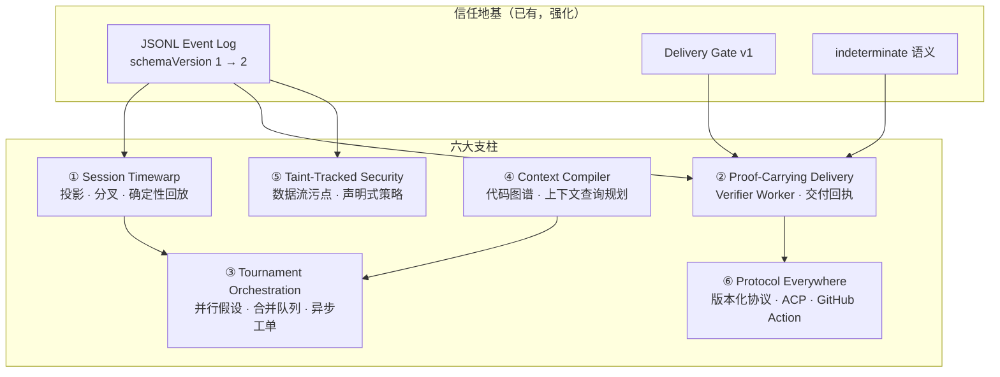
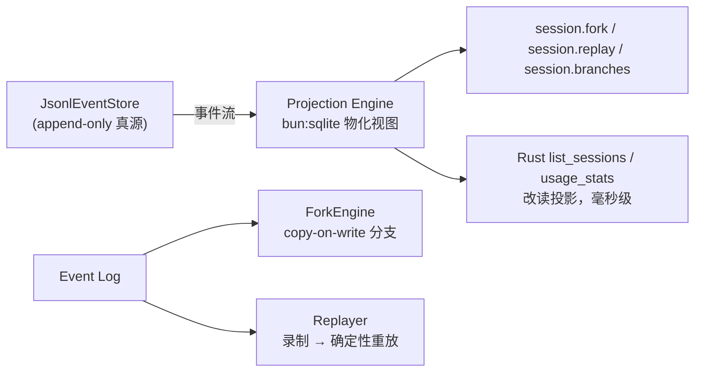
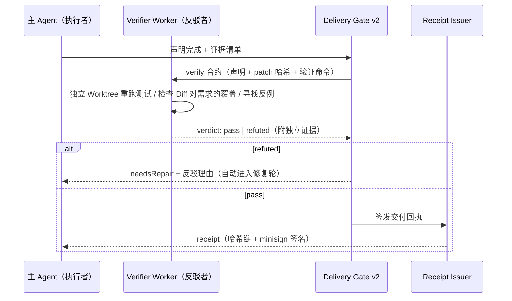
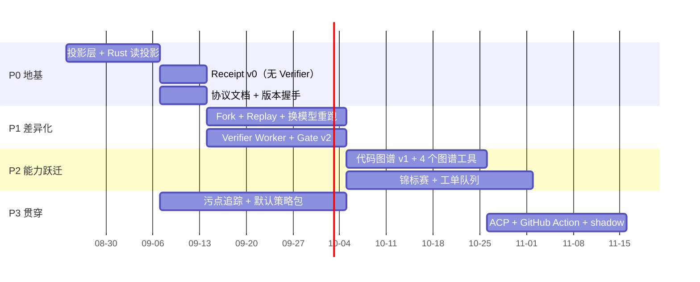

# DeepSeek Code 下一代架构：可证明、可回放、可编排的编码 Agent

> 目标：在 Claude Code、Codex、OpenCode、pi 的包围中建立**可持续的技术领先**。
> 本文档是设计真源（Design Source of Truth），每个支柱都细化到模块、类型与集成点，
> 验收指标挂在现有 `benchmarks/` 发布门槛体系上，不允许"感觉上更强"。

---

## 0. 战略判断：赢在哪里，不赢在哪里

### 0.1 模型不是护城河，信任基础设施才是

BYOK 决定了我们和竞品共享同一个模型供给（DeepSeek / GPT / Claude / Qwen……）。
模型能力趋同时，差距只能来自模型之外的四个乘数：

| 乘数 | 含义 | 竞品现状 |
| --- | --- | --- |
| **可恢复性** | 崩溃、中断、换机后工作不丢、不假造 | 各家有会话持久化，无事件级恢复语义 |
| **可审计性** | 每个结论可追溯到事件与证据 | Claude Code 有 transcript，Codex 云任务近乎黑盒 |
| **可验证性** | "完成了"是可证伪、可第三方验证的声明 | 全员靠模型自评，无对抗验证 |
| **可回放性** | 任意会话可确定性重放、可从任意点分叉 | 无人做到事件级；rewind/checkpoint 只是文件快照 |

**我们的起点优势**：`JsonlEventStore`（事件溯源）、`evaluateDeliveryGate`（交付门禁）、
`tool_indeterminate`（未知副作用绝不重放）、soak 故障注入测试——这四件事在竞品里
没有一家同时做到。下一代架构不是另起炉灶，而是把这四个种子养成壁垒。

### 0.2 竞争定位矩阵

| 对手 | 它的内核 | 它的盲区 | 我们的打法 |
| --- | --- | --- | --- |
| **Claude Code** | 模型调教 + 生态（MCP/Hooks/Subagent） | 闭源、云依赖、会话不可分叉回放、交付自证 | 本地优先 + 事件溯源 + 交付回执；生态上兼容 MCP 而非对抗 |
| **Codex** | 云沙箱并行 + GitHub 集成 | 云端黑盒、不可审计、供应商锁定 | 本机并行锦标赛 + 全程留痕；GitHub 能力对齐（已有 CI 修复会话） |
| **OpenCode** | 开源、Provider 灵活、TUI 手感 | 无验证门禁、无恢复语义、安全模型薄 | 工程严谨度碾压：门禁/恢复/脱敏/soak 测试全做满 |
| **pi** | 极简哲学：模型即 Agent，脚手架最少 | 无审批、无恢复、无验证，玩具化风险 | 吸收其工具极简主义，但在可靠性维度不降配 |

**一句话战略**：做"最严谨、最可审计的编码 Agent"——当别人的 Agent 说"修好了"，
我们的 Agent 递上一张**可离线验证的交付回执**。

### 0.3 六大支柱总览



依赖关系决定实施顺序：**① → ② → ③** 是主线，④ 与 ③ 互相放大，⑤⑥ 贯穿始终。

---

## 1. 支柱一：Session Timewarp —— 会话投影、分叉与确定性回放

> 差异化最大、工程量中等、且是所有后续支柱的地基。**先做。**

### 1.1 现状

- 事件写入：[apps/deepseek-agent-runtime/src/main.ts](apps/deepseek-agent-runtime/src/main.ts) 的
  `JsonlEventStore.append()`（L215–325），每条事件已带
  `schemaVersion / eventID / commandID / causationID / correlationID / sessionID / sequence`。
- 读取是全量扫描：`loadConversation / loadPendingApproval / loadEvents / loadRepairLineage`
  每次都 `readFile` 整个 JSONL；Rust 侧 `compute_usage_stats` 每次扫描**所有**会话文件
  （[main.rs](apps/deepseek-code-desktop/src-tauri/src/main.rs) L187–270）。会话多了以后这是 O(N×M) 的浪费。
- 恢复：`recoverInterruptedSessions()` 已能区分"未领取输入 / 待审批 / indeterminate / 中断 turn"。

### 1.2 目标架构



### 1.3 技术方案

#### 1.3.1 投影层（`src/core/session-projection.ts`，新模块）

Sidecar 用 Bun 编译（`bun build --compile`），**直接使用内置 `bun:sqlite`，零新增依赖**。

```ts
// src/core/session-projection.ts
import { Database } from "bun:sqlite"

export interface Projection {
  recordEvent(sessionID: string, sequence: number, type: string, payload: Record<string, unknown>, createdAt: string): void
  listSessions(): SessionSummaryRow[]                    // 供 Rust/CLI 复用的行结构
  usageStats(days?: number): UsageStatsRow               // 替代 Rust 全量扫描的 SQL 版
  conversationAt(sessionID: string, sequence: number): AgentMessage[]  // 分叉点的上下文快照
  searchEvents(filter: { type?: string; sessionID?: string; since?: string }): EventRow[]
}

export function openProjection(dbPath: string): Projection // 幂等建表 + WAL 模式
```

Schema：

```sql
CREATE TABLE IF NOT EXISTS events (
  session_id TEXT NOT NULL,
  sequence   INTEGER NOT NULL,
  event_id   TEXT NOT NULL,
  type       TEXT NOT NULL,
  payload    TEXT NOT NULL,          -- JSON
  created_at TEXT NOT NULL,
  PRIMARY KEY (session_id, sequence)
);
CREATE INDEX IF NOT EXISTS idx_events_type ON events(type, created_at);

CREATE TABLE IF NOT EXISTS sessions (
  session_id TEXT PRIMARY KEY,
  title TEXT, project_path TEXT,
  forked_from TEXT, fork_base_sequence INTEGER,   -- 支柱一的分叉元数据
  created_at TEXT, updated_at TEXT
);

CREATE TABLE IF NOT EXISTS usage (                 -- usage_recorded 的展开列，统计免 JSON 解析
  session_id TEXT, sequence INTEGER,
  model TEXT, input_tokens INTEGER, cached_input_tokens INTEGER, output_tokens INTEGER,
  created_at TEXT
);
```

写入策略：`JsonlEventStore.append()` 成功后同步写投影（同事务性等级：投影可从 JSONL
全量重建，JSONL 永远是真源，投影损坏只需 `projection rebuild`）。启动时校验
`max(sequence)` 水位，落后则增量补扫——**投影是可丢弃的缓存，这是设计纪律**。

Rust 侧改造：`list_sessions` / `usage_stats` / `load_session_history` 改为执行只读 SQL
（rusqlite 或继续读 JSONL 但先查投影水位做短路；推荐 rusqlite，`Cargo.toml` 加一个依赖）。
收益：`usage_stats` 从 O(全部会话字节) 降为 O(索引)。

#### 1.3.2 分叉（ForkEngine）

分叉语义：**从任意事件序号 N 派生新会话，携带 N 之前的完整上下文，之后各行其是。**

```ts
// src/core/session-fork.ts
export interface ForkRequest {
  sourceSessionID: string
  baseSequence: number          // 分叉点；默认源会话最新
  reason?: string               // "换 GPT 重跑" / "换个方案" —— 进日志，可审计
}
export interface ForkResult { sessionID: string; baseSequence: number; inheritedMessages: number }

export async function forkSession(store: JsonlEventStore, projection: Projection, request: ForkRequest): Promise<ForkResult>
```

实现：**Copy-on-write**。新会话的 JSONL 首行写 `session_forked`
（payload: `{ sourceSessionID, baseSequence, reason }`），事件正文不复制；
`loadConversation` 遇到 `session_forked` 时回溯源日志到 `baseSequence` 重建历史。
分支元数据入 `sessions.forked_from / fork_base_sequence`，UI 可按分支树展示。

配套能力（这是分叉真正值钱的地方）：

- **换模型重跑**：fork 后 `session.run` 时覆盖 `model`/`baseURL`——同一上下文、不同模型，
  结果并排进 benchmark 语料。A/B 评估模型从"跑两次"变成"一次分叉"。
- **What-if 调试**：prompt 工程改动后，从失败会话的事故点前一个事件分叉重放，验证修复。

#### 1.3.3 确定性回放（Replayer）

```ts
// src/core/session-replay.ts
export interface ReplayOptions {
  sessionID: string
  untilSequence?: number
  mode: "verify" | "narrate"    // verify：断言事件逐一匹配；narrate：导出人类可读时间线
}
export async function replaySession(options: ReplayOptions): Promise<{ matched: number; divergedAt?: number }>
```

回放的关键是**消除非确定性**：

1. 模型流：新增事件 `model_stream_recorded`（仅录制模式写入，payload 为 delta 序列的
   规范化摘要 + 哈希 + 完整内容落 Evidence 文件）。回放时 `RecordingProvider` 按序吐出
   已录 delta——复用 benchmarks 的 mock Provider 思路（[runner.mjs](benchmarks/runner.mjs) L33–58），
   但数据源从 fixture 变成真实会话。
2. 工具：`read_file / list_directory / search_workspace` 等只读工具回放时直接重放录制输出；
   `apply_patch / run_command` 回放时**只比对参数哈希不执行**（写操作永不重放——
   与 indeterminate 纪律一致）。
3. 时间：`createdAt` 全部来自日志，不回放墙钟。

验收：soak 测试（[soak.mjs](benchmarks/soak.mjs)）增加一条不变量——
"任意崩溃会话 replay 到崩溃点，事件序列逐字节一致"。

#### 1.3.4 IPC 与 UI

- Sidecar 新增 method：`session.fork`、`session.replay`、`session.branches`
  （`Request["method"]` 联合类型扩展，[main.ts](apps/deepseek-agent-runtime/src/main.ts) L57–65）。
- CLI：`node bin/deepseek.mjs session fork <id> [--at <sequence>] [--reason "..."]`、`session replay <id>`。
- UI：对话时间线上每条消息右上角"⑂ 分叉"按钮；会话列表按分支树缩进展示。

### 1.4 为什么这能赢

Claude Code 的 rewind 是文件状态快照，Codex 的任务记录在云端不可导出，OpenCode 和 pi
连恢复语义都没有。**"给我看下三个月前那个决策是怎么做出来的"** ——只有我们能回答，
还能当场从那个点分叉重跑。对企业合规、对调试 agent 行为本身，这是降维打击。

---

## 2. 支柱二：Proof-Carrying Delivery —— 对抗验证与交付回执

> 把 Delivery Gate 从"规则判定"升级为"证伪驱动的证明"。这是品牌支柱：
> **DeepSeek Code 的 delivered 是一个证明，不是一句话。**

### 2.1 现状

[delivery-gate.ts](src/core/delivery-gate.ts) 是纯规则：无未决审批、无 indeterminate、
无失败工具、有 `verification_passed` → `delivered`。弱点：验证证据由**执行者自己**产生，
模型既当运动员又当裁判。竞品的"完成"声明也是自评——这是我们的攻击面。

### 2.2 目标架构



### 2.3 技术方案

#### 2.3.1 Verifier Worker（`src/core/verifier-worker.ts`，新模块）

Worker 体系扩展（`WorkerType` 当前为 `'explore' | 'review' | 'research' | 'ci'`，
[worker-runtime.ts](src/core/worker-runtime.ts) L6），新增 `'verify'`。与现有只读 Worker 的
关键差异：Verifier 在**独立 Git Worktree**（复用 [git/worktree.ts](src/core/git/worktree.ts)）
中检出"主 Agent 声称的最终状态"，并允许运行**测试命令**（只读 Worker 的例外，
通过独立工作区 + 命令白名单控制风险）：

```ts
export interface VerifierContract {
  workerID: string
  parentSessionID: string
  projectPath: string
  /** 主 Agent 的完成声明（自然语言，取自 turn 最终文本） */
  claim: string
  /** 主 Agent 工作区最终补丁的 SHA-256（apply_patch 检查点已维护哈希链） */
  patchHash: string
  /** 声明涉及的验收命令，白名单约束：test|lint|build|typecheck 族 */
  commands: string[]
  /** 需求原文（用户 prompt），用于"Diff 是否对应需求"检查 */
  requirement: string
}

export interface VerifierVerdict {
  state: "pass" | "refuted" | "inconclusive"
  /** refuted 时必须给出反例证据：失败测试名、未覆盖的需求点、遗漏边界 */
  counterEvidence: string[]
  evidence: VerifierEvidence[]       // 每条带 exitCode、stdout 哈希、耗时、环境指纹
  patchMatchesClaim: boolean         // 独立重算 patchHash 与声明一致
}
```

事件流：`verification_claimed → verifier_started → verifier_verdict`（refuted 时
`delivery_evaluated: needsRepair`，理由含 counterEvidence）。反驳结果回灌主会话上下文：
"Verifier 反驳：测试 `login-timeout.test.ts` 在你的补丁下仍失败"——形成自动修复轮，
最多 2 轮后升级给人。

#### 2.3.2 交付回执（`src/core/delivery-receipt.ts`，新模块）

```ts
export interface DeliveryReceipt {
  schemaVersion: 1
  receiptID: string
  sessionID: string
  issuedAt: string
  project: { path: string; headCommit: string; branch: string }
  patch: { hash: string; files: string[]; checkpointID: string }   // 哈希链到 apply_patch 检查点
  gate: { state: DeliveryState; reasons: string[] }
  evidence: Array<{ kind: "tests" | "browser" | "ci" | "citation"; command?: string; exitCode?: number; outputHash: string; capturedAt: string }>
  verifier: { workerID: string; verdict: VerifierVerdict["state"] }
  events: { fromSequence: number; toSequence: number; logHash: string }  // 事件日志区间哈希
  signature?: string                                                 // minisign，复用 updater 密钥基建
}
```

签名复用发布基建：`scripts/package-tauri-release.sh` 已用 minisign 签 updater 包，
同一把密钥（`~/.tauri/deepseek-code.key`）签回执；验证方只需公钥。

**第三方离线验证**（杀手锏）：

```bash
node bin/deepseek.mjs receipt verify ./receipt.json --project /path/to/repo
# 校验：签名有效 → 事件日志哈希匹配 → 补丁哈希匹配 → 逐条重算证据输出哈希 → 输出 verdict
```

不安装 App 也能验（verify 子命令零依赖，可单文件分发）。这意味着
**交付物第一次可以被不信任我们的审计方独立确认**——竞品无人能给出这个承诺。

#### 2.3.3 Gate v2

`evaluateDeliveryGate` 增加一条最高优先级规则：
`delivered` 要求 `verifier_verdict(state=pass)` **且** `receipt_issued`；
原规则退化为 `handoffReady` 的判定。旧会话无回执按 v1 规则兼容评估（投影层记录 gate 版本）。

### 2.4 为什么这能赢

- Claude Code / Codex / OpenCode / pi 的"完成"全部不可证伪——模型说行就行。
   seeded-bug 语料上，单 Agent 自评的漏检率是公开痛点；Verifier 是结构性解法。
- 交付回执把"信任"从品牌叙事变成**可下载验证的密码学对象**，
  企业采购、外包验收、开源 maintainer 审查 AI PR——全是真实付费场景。

---

## 3. 支柱三：Tournament Orchestration —— 并行假设、合并队列与异步工单

> Codex 的并行是"N 个云沙箱各做各的"；Claude Code 的 subagent 是单线程委派。
> 下一代是**带合并语义的锦标赛**：同题多解、证据裁决、确定性合并。

### 3.1 现状

- 只读 Worker 子进程：[main.ts](apps/deepseek-agent-runtime/src/main.ts) `delegateWorker()`（L570–594），30s 超时，结果回主会话。
- 分支/工作树：[git/worktree.ts](src/core/git/worktree.ts) `createTaskBranchName()` → `deepseek/<task>`。
- 异步雏形：[ci-repair-queue.ts](src/core/ci-repair-queue.ts) 把 CI 修复延迟到主会话安全边界。

### 3.2 技术方案

#### 3.2.1 锦标赛（`src/core/arena.ts`，新模块）

```ts
export interface Tournament {
  tournamentID: string
  parentSessionID: string
  prompt: string
  hypotheses: Hypothesis[]          // 2–3 条，由规划模型从 prompt 生成或用户显式给出
  status: "running" | "judging" | "merged" | "aborted"
}

export interface Hypothesis {
  id: string
  approach: string                  // 一句话方案，例如 "从会话缓存层修" vs "从事件总线修"
  forkedSessionID: string           // 支柱一：从主会话分叉，继承全部上下文
  worktreePath: string              // 支柱三：独立工作树，物理隔离写入
  branch: string                    // deepseek/arena-<id>-h<n>
  result?: { patchHash: string; testExitCode: number; diffStat: string; tokensUsed: number }
}
```

流程：

1. **触发条件**（路由层决策，`execution-decision.ts` 扩展）：`code_change` 且
   预估影响面 > 阈值（代码图谱：受影响符号数），或用户显式 `/arena`。
   简单任务绝不进锦标赛——成本控制纪律。
2. **发散**：规划模型生成 2–3 条**互斥假设**（不同根因方向/不同架构层）。
3. **并行执行**：每条假设一个 fork 会话 + 一个 worktree，全部走正常
   ToolExecutionPipeline（权限、脱敏、事件日志不打折）。并发上限 3，串行排队兜底。
4. **裁决**（Judge）：独立模型调用，输入 = 需求 + 各假设的 {diff, 测试结果, evidence}，
   输出结构化评分：`{ testsPass, diffMinimality, evidenceCoverage, riskNotes }`，
   平分时取 diff 更小者。**Judge 不允许看到假设编号以外的身份信息**，避免位置偏置。
5. **合并**：胜者补丁经 `apply_patch`（带检查点与乐观哈希）落到主工作区；
   败者分支保留 30 天，其失败结论作为 **negative evidence** 注入主会话上下文
   （"方向 B 已证伪：`auth/session.ts` 的缓存键不含 tenantID"）——
   这是锦标赛独有的产出：不仅赢，还知道为什么别的路不通。
6. **事件**：`tournament_started / hypothesis_completed / tournament_judged / tournament_merged`，
   Delivery Gate 把 `tournament_merged` 视为强验证信号。

#### 3.2.2 异步工单队列（`src/core/task-queue.ts`，新模块）

把 `CIRepairQueue` 的"延迟到安全边界"泛化为通用工单系统：

```ts
export type TaskTicketState =
  | "queued" | "running"
  | "waiting_approval"      // 审批事件到达自动续跑（已有 resolveApproval 链路）
  | "waiting_ci"            // 挂起，轮询 github_ci_status 或收 webhook
  | "waiting_dependency"    // 等另一个工单 merge
  | "done" | "failed"

export interface TaskTicket {
  ticketID: string
  sessionID: string                  // 每个工单一条会话（可 fork）
  prompt: string
  state: TaskTicketState
  priority: number
  blockedBy?: string[]               // 依赖图，拓扑调度
  createdAt: string
}
```

状态迁移全部走事件日志（`ticket_enqueued / ticket_state_changed`），
崩溃后由 `recoverInterruptedSessions()` 同款扫描恢复——工单系统**免费继承**全部恢复语义。
UI 形态：会话列表旁一个"工单"面板，Agent 从"同步对话"进化成"可挂起、可依赖、
可后台推进的任务系统"——这是 Codex 云任务的本地等价物，但全程可审计。

### 3.3 为什么这能赢

- 对 Codex：它有并行无量裁与合并语义，且过程不可见；我们输出裁决证据链。
- 对 Claude Code：subagent 是"委派-汇报"，锦标赛是"竞争-证伪"，难题成功率结构性更高
  （多假设覆盖率问题，公开研究和我们自己的 seeded-bug 语料都可验证）。
- 成本可控：锦标赛只在高影响任务触发，且 fork 共享前缀上下文（缓存命中）。

---

## 4. 支柱四：Context Compiler —— 代码图谱与上下文查询规划

> 现在的 `buildContext` 是"字符预算裁剪"；领先的做法是把上下文组装当成**查询规划器**：
> 用本地代码图谱把"探索成本"压到对手的零头。

### 4.1 现状

- [context-builder.ts](src/core/context-builder.ts)：120K 字符预算、工具输出 6K 压缩、保留最近 20 条——纯文本启发式。
- 项目理解靠 `search_workspace` 全文搜 + `read_file`，每次探索都烧模型 token。
- LSP 已接（[lsp-client.ts](src/core/lsp-client.ts)），但只暴露 `lsp_diagnostics` 一个工具。

### 4.2 技术方案

#### 4.2.1 增量代码图谱（`src/core/code-graph/`，新目录）

```ts
// src/core/code-graph/index.ts
export interface CodeGraph {
  upsertFile(path: string, content: string): void          // mtime+hash 增量，只重索引变更文件
  removeFile(path: string): void
  symbolCard(name: string): SymbolCard | undefined          // 签名+doc+定义位置+引用数
  whoCalls(symbol: string): Reference[]
  references(symbol: string): Reference[]
  impactedBy(files: string[]): { symbols: string[]; tests: string[] }  // diff → 受影响符号 → 建议测试
  searchSymbols(query: string, limit?: number): SymbolCard[]
}

export interface SymbolCard {
  name: string; kind: "function" | "class" | "type" | "interface" | "constant"
  file: string; line: number; signature: string; doc?: string
  referenceCount: number; importedBy: string[]
}
```

实现路径（务实两阶段）：

- **v1（4 周）**：不引 tree-sitter。符号提取用**语言正则族 + 已有 LSP client**
  （`textDocument/documentSymbol / references`，语言服务器配置走 `.deepseek/lsp.json`，已支持），
  存储进投影层同一个 `bun:sqlite` 库（`symbols / edges / files` 三表）。
  覆盖 TS/JS/Swift/Rust/Python/Go 的正则族即可吃下 80% 价值。
- **v2**：web-tree-sitter（WASM，可编进 Bun sidecar）替换正则提取，拿到精确 AST 边。

索引时机：首次 `session.run` 时后台构建（事件 `graph_index_started/completed`），
之后文件变更（`apply_patch` 检查点、git 状态轮询）触发增量更新。索引失败的降级 =
现状（退化为全文搜索），**永不让图谱成为单点故障**。

#### 4.2.2 新工具（注册进 [main.ts](apps/deepseek-agent-runtime/src/main.ts) 的 toolSchemas）

| 工具 | 语义 | 替代的旧路径 |
| --- | --- | --- |
| `graph_symbol_card` | 一张符号卡：签名/文档/定义/引用数/相关测试 | 3–6 次 read_file + grep |
| `graph_who_calls` | 调用方列表（含间接一层） | 全文搜 + 人工筛 |
| `graph_change_impact` | 给 diff/文件清单，返回受影响符号与建议测试 | 模型凭直觉选测试 |
| `graph_module_map` | 目录级依赖摘要，喂给规划阶段 | explore worker 全量列目录 |

每个图谱工具返回**压缩卡**（≤ 500 字符），尾部带 `evidenceRef` 指向完整数据——
上下文里放摘要，证据留全量，与现有"压缩但可追溯"哲学一致。

#### 4.2.3 上下文查询规划器（重写 `buildContext` 内部，签名不变）

```ts
export interface ContextPlan {
  systemPrefix: AgentMessage[]      // 稳定前缀：系统指令+项目规则（缓存命中最大化，置顶不动）
  graphCards: AgentMessage[]        // 本轮回路相关的符号卡（按相关度×预算贪心打包）
  conversation: AgentMessage[]      // 最近对话（现有 keepRecent 逻辑）
  evidencePointers: AgentMessage[]  // 被压缩内容的指针清单
}

export function planContext(messages: AgentMessage[], graph: CodeGraph | undefined, budget: ContextBudget): AgentMessage[]
```

代价模型：每条候选上下文按 `相关度 / token 成本` 排序，预算内贪心；
**缓存稳定性是硬约束**——前缀内容按 (系统 → 图谱卡 → 对话) 固定顺序排列，
同一 turn 内前缀字节级稳定，最大化 Provider 侧 prompt cache 命中
（`usage_recorded.cachedInputTokens` 已能度量收益）。

#### 4.2.4 Shadow Eval —— 让上下文策略可离线迭代

`npm run bench:shadow`：用支柱一的 Replayer 把录制会话喂给**新** planner，
对比 token 总量、缓存命中率、（real 模式）任务成功率。**任何 prompt/上下文策略改动
先在影子评测里跑赢基线才合入**——这是竞品没有的工程飞轮，直接长在前两大支柱上。

### 4.3 为什么这能赢

探索类任务（proj/expl fixture 族）的 token 大头是"找代码"。图谱命中时，
`graph_symbol_card` 一次调用替代 3–6 次读写往返——**探索成本数量级下降**，
同样的 BYOK 额度，用户能做更多任务。Claude Code/Codex 的代码索引是云侧黑盒
（且对本地私有代码有上传顾虑），我们是**本机常驻、零上传、可审计**。

---

## 5. 支柱五：Taint-Tracked Security —— 把 Prompt Injection 当一等公民

> 现状的安全是"提示词里提醒模型别被骗"（README：网页内容是不可信数据）。
> 下一代：**架构上骗不了**——不可信数据带着污点标签流动，策略引擎决定它能触发什么。

### 5.1 技术方案

#### 5.1.1 污点标签（`src/core/taint.ts`，新模块）

```ts
export type TaintLabel =
  | "trusted"             // 用户输入、项目文件（工作区内）
  | "untrusted-web"       // web_fetch / web_search 输出
  | "untrusted-mcp"       // 一切 mcp__* 工具输出
  | "untrusted-worker"    // Worker 摘要（派生自项目内容但经模型改写）
  | "untrusted-browser"   // browser_evidence 采集的 DOM/console
  | "untrusted-ci"        // CI 日志、PR 描述等外部文本

export interface TaintedContent { text: string; taint: TaintLabel; source: string }
```

集成点——`ToolExecutionPipeline.invokeHost()`（[tool-execution-pipeline.ts](src/core/tool-execution-pipeline.ts) L120–159）
在 `serialize()` 处按工具→标签映射贴标；`AgentMessage` 增加可选 `taint` 元数据，
事件日志 payload 同步记录（脱敏先行，污点标签本身不含内容）。

#### 5.1.2 声明式策略（`.deepseek/policy.json`，项目级、可审计、进 git）

```jsonc
{
  "rules": [
    { "id": "web-no-direct-write",
      "when": { "contextTaint": ["untrusted-web"], "tool": ["apply_patch", "run_command"] },
      "then": "require_approval",
      "reason": "联网内容进入上下文后，写入操作需人工确认" },
    { "id": "mcp-no-exfil",
      "when": { "contextTaint": ["untrusted-mcp"], "tool": ["web_fetch"], "argPattern": { "url": ".*\\?.*(token|key|secret).*" } },
      "then": "block",
      "reason": "疑似经不可信内容引导的数据外泄" },
    { "id": "ci-log-no-execute",
      "when": { "contextTaint": ["untrusted-ci"], "tool": ["run_command"] },
      "then": "require_approval" }
  ]
}
```

执行点：Pipeline `execute()` 内、`preToolUse` hooks 之后、`runtime.requestTool` 之前——
计算当前上下文污点集合（最近 N 条消息的标签并集），逐条评估规则，
`then` 只能**升级**决策（allow→ask、ask→block），永不降级。默认策略包内置
（上方三条 + L4 现有正则），项目策略只能加严。

#### 5.1.3 注入侦测

`web_fetch` / MCP 输出落日志前过一遍启发式扫描器
（"ignore previous instructions"、伪造 `<system>` 标签、"the user confirmed" 等模式族），
命中即发 `injection_suspected` 事件并把该内容污点升级为最高级。
已有基础：[web-search-providers.ts](src/core/web-search-providers.ts) 的 Citation 警告是同一思路的雏形，
现在从"提示"升级为"机制"。

### 5.2 为什么这能赢

prompt injection 是所有联网 Agent 的公开软肋，竞品的防线是系统提示里的一句话。
我们把"不可信数据不能静默升级为动作"做成**数据流强制**：
策略文件进 git、每条拦截有事件、每次升级可审计。
安全研究员社区会替我们传播这个设计——这是最便宜的获客。

---

## 6. 支柱六：Protocol Everywhere —— 一个 Runtime，无数个前端

> Sidecar 的 stdio JSONL 已经是协议。把它版本化、文档化、适配化，
> 让 Tauri App / CLI / IDE / CI 都挂在同一条会话总线上。

### 6.1 技术方案

1. **协议版本化**（`src/core/protocol.ts` + `docs/protocol.md`）：
   `health` 响应增加 `protocolVersion: 2` 与 `capabilities: ["fork", "replay", "arena", ...]`；
   客户端握手时声明版本，sidecar 对未知 capability 明确降级而非报错。
   事件 schema 升 `schemaVersion: 2`（新增字段向后兼容，投影层按版本分流解析）。
2. **ACP 适配器**（`bin/deepseek-acp.mjs`）：Zed 主导的 Agent Client Protocol →
   我们的 `session.*` 方法的翻译层。一次适配，Zed/Neovim/任何 ACP 客户端免费获得前端。
   OpenCode 证明了"开放协议换生态"的价值，但我们多带一样东西：
   ACP 前端也能拿到**交付回执与门禁状态**——别家的 ACP 后端给不了。
3. **GitHub Action**（`action.yml`，repo 根）：`deepseek-code/action@v1` ——
   PR 触发时跑 Verifier + Review Worker，评论交付回执摘要。
   对标 Codex review bot 与 Claude Code Action，差异化是**回执可离线验证**。
4. **CLI 补全**：`session fork/replay`、`receipt verify`、`ticket list`（支柱三工单）。

---

## 7. 实施路线图

> 原则：每个 Phase 结束产品都比之前更强，不做"半成品大重构"。
> 每周跑 `npm run bench && npm run bench:soak`，指标退化即停线。



### Phase 0：信任地基（3 周）

| 交付物 | 验收 |
| --- | --- |
| `session-projection.ts` + Rust 读投影 | 10K 事件/会话 × 50 会话下 `usage_stats` < 50ms；投影删除后可从 JSONL 全量重建 |
| `delivery-receipt.ts` v0（Gate v1 结论 + 证据哈希 + minisign 签名） | `receipt verify` 对历史会话验证通过；篡改任一字节即失败 |
| `docs/protocol.md` + 版本握手 | 旧 CLI 连新 sidecar 明确降级；e2e 通过 |

### Phase 1：可回放 + 可证伪（4 周）

| 交付物 | 验收 |
| --- | --- |
| `session-fork.ts` / `session-replay.ts` + CLI/UI | soak 新增不变量"崩溃会话回放到崩溃点逐字节一致"；换模型分叉重跑产出对照报告 |
| `verifier-worker.ts` + Gate v2 | seeded-bug 语料（≥ 20 个注入缺陷的修复任务）：Verifier 拦截率 ≥ 70%，误拦率 ≤ 10% |
| `bench:shadow` | 任一上下文策略改动可离线对比 token/缓存/成功率 |

### Phase 2：编排与上下文（5–7 周）

| 交付物 | 验收 |
| --- | --- |
| `code-graph` v1 + 4 个图谱工具 | proj/expl fixture 族 token 消耗降 ≥ 40%（shadow eval 证明）；索引失败自动降级不阻塞会话 |
| `arena.ts` 锦标赛 | seeded-bug 语料：锦标赛 vs 单跑成功率 +10pp；败者 negative evidence 出现在主会话上下文 |
| `task-queue.ts` 工单 | waiting_ci 工单在 CI 转绿后自动续跑；崩溃恢复覆盖全部工单状态 |

### Phase 3：防线与生态（持续）

| 交付物 | 验收 |
| --- | --- |
| 污点追踪 + 默认策略包 | injection fixture 族（已有 `inj-` 前缀起步）：策略拦截率 100%，无误伤放行类误报 |
| ACP 适配器 + GitHub Action | Zed 通过 ACP 完成一次带审批的修改；Action 在示例仓库 PR 上留下可验证回执评论 |

---

## 8. 量化胜利条件（挂进 `benchmarks/score.mjs` 与发布门槛）

现有门槛保留（成功率 ≥ 对手 +3pp、低风险审批 ≤ Claude Code 60%、恢复率 100%、
Citation 覆盖 ≥ 95%），**新增**：

| 指标 | 目标 | 度量方式 |
| --- | --- | --- |
| delivered 带可验证回执比例 | 100% | Gate v2 强制，`receipt_issued` 事件计数 |
| Verifier 拦截率 / 误拦率 | ≥ 70% / ≤ 10% | seeded-bug 语料（fixture 新族 `sb-*`） |
| 会话可回放率 | 100% | soak：崩溃会话 replay 一致性断言 |
| 探索任务 token 成本 | 较 v0.2 基线降 ≥ 40% | shadow eval 对比 `usage_recorded` |
| 锦标赛难题成功率增益 | +10pp | seeded-bug 语料 A/B |
| 前缀缓存命中率 | ≥ 60%（多轮会话） | `cachedInputTokens / inputTokens` |
| 注入拦截率 | 100% | `inj-*` fixture 族全绿 |

**纪律**：以上任何一条不达标，README 不得出现对应宣传语——沿用现有
"已具备 vs 正在硬化"表格的诚实传统，它本身就是品牌。

---

## 9. 明确不做什么

- **不做云同步 / 团队 SaaS / 产品云 Agent**（README 既有边界，本地优先是定位不是缺陷）。
- **不做自研模型**：模型是乘数的基数，不是我们的战场；快速模型分层已够。
- **不做"无人值守全自动"**：与 indeterminate 哲学直接冲突；我们的叙事是
  "自动化到证据边界为止，边界外交给人"。
- **不做 Windows/Linux 1.0**：协议化让社区可以自己接，官方资源守住 macOS 体验。
- **不追工具数量**：pi 的教训值得吸收——工具少而语义硬（回执/污点/分叉），
  胜过工具多而语义软。

---

## 10. 风险与对策

| 风险 | 对策 |
| --- | --- |
| Verifier 误拦导致"交付不了"挫败感 | `inconclusive` 第三态 + 人工 override（审批事件留痕）；误拦率纳入发布门槛 |
| 锦标赛 token 成本失控 | 路由层硬触发条件 + 并发上限 3 + fork 共享前缀缓存；成本进 shadow eval 门禁 |
| 图谱索引在巨仓下变慢 | 增量 + 懒加载（先索引 `git ls-files` 热点目录）+ 失败静默降级为全文搜索 |
| bun:sqlite 绑定在未来 Bun 版本变动 | 投影层接口隔离（`Projection` interface），可整体替换实现；JSONL 永远是真源 |
| 回执签名密钥管理 | 复用 updater 密钥基建与 `TAURI_SIGNING_PRIVATE_KEY` 纪律；提供 `receipt verify --no-signature` 降级模式（只验哈希链） |
| 功能膨胀拖垮手感 | 每个 Phase 结束跑完整 bench + soak；`npm run dev` 启动的默认路径不允许变慢 |

---

*本文档与 [FULL_SPECTRUM_DOMINANCE.md](FULL_SPECTRUM_DOMINANCE.md)（全面领先作战纲领）、
`OPTIMIZATION_DETAILED_PLAN.md`、`ADVANCED_SEARCH_PLAN.md` 的关系：
本文档是 v0.3+ 的架构实现真源；作战纲领规定战略排序与架构之外的战线（智能/手感/成本/生态）。
冲突时战略以纲领为准、技术细节以本文档为准。*
