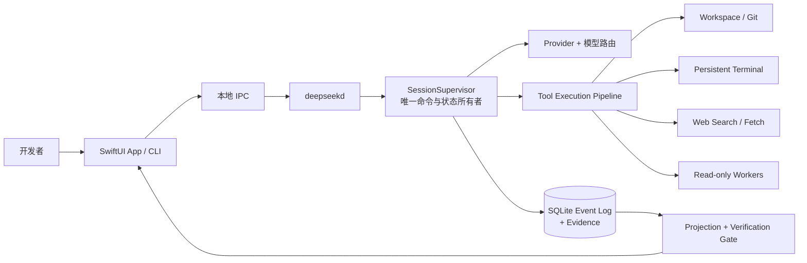
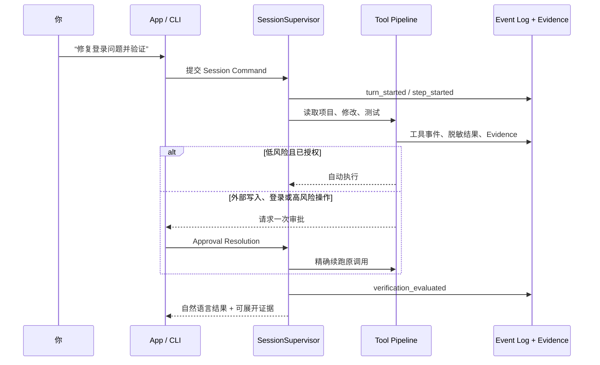
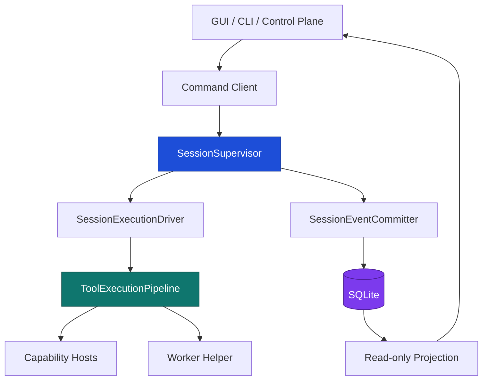
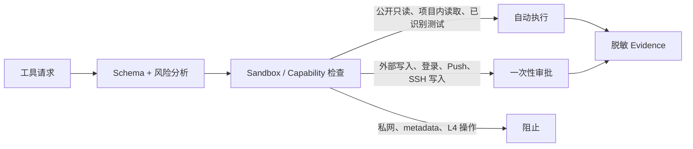

<div align="center">

# DeepSeek Code

**本地优先、原生 macOS 的编码 Agent 工作台。**

将对话、计划、工具、证据、审批与交付状态收进同一条可恢复的 Session。

[下载最新版](https://github.com/shidesheng0218/deepseek-code/releases/latest) · [快速开始](#下载使用) · [架构](#当前产品真源) · [安全与权限](#当前命令风险策略) · [开发](#本地开发)

`macOS 14+` · `Apple Silicon` · `SwiftUI` · `BYOK` · `本地优先`

</div>

> [!NOTE]
> 这是一个非官方开源项目，与 DeepSeek 无隶属关系。项目不提供产品云 Agent：模型凭据、项目文件、Session 和证据默认保留在用户的 Mac 上。

## 为什么是 DeepSeek Code？

它不是简单地把聊天框和终端并排放在一起，而是把一次任务作为可恢复、可审计的工作单元：模型回复、工具调用、权限决定、文件证据和验证结果都绑定到同一个 Session。

| 你关心的事           | DeepSeek Code 的处理方式                                |
| -------------------- | ------------------------------------------------------- |
| “帮我修这个 Bug”     | 读项目 → 修改 → 运行验证 → 汇总变更与风险               |
| “查官方文档”         | 公开只读搜索与抓取自动执行，并保存可追溯 Citation       |
| “不要一直点审批”     | 项目内读取、已识别测试和公开联网低打断；外部交付仍受控  |
| App 或 Provider 中断 | Session 事件持久化；状态未知的副作用绝不自动重放        |
| “这次到底做了什么？” | 对话保持自然，工具、证据、风险和用量可在 Inspector 展开 |



## 下载使用

普通用户不需要安装 Node、Swift，也不需要运行终端命令：

1. 打开 [GitHub Releases](https://github.com/shidesheng0218/deepseek-code/releases/latest)。
2. 下载 `DeepSeek-Code-<version>-arm64.dmg`。
3. 打开 DMG，把 **DeepSeek Code.app** 拖到 **Applications**，然后双击启动。
4. 首次启动如果 macOS 提示无法验证开发者，右键 App 选择“打开”，确认一次即可；这只适用于未配置 Apple Developer ID 的社区构建。

启动后只需配置 **Base URL、API Key 和项目目录**。开发工具链和发布流程由项目维护者处理，用户不需要配置证书、公证或 GitHub Actions。

当前 Release 是 Apple Silicon（arm64）版本，要求 macOS 14 或更高版本。

## 当前产品真源

正式产品是 **SwiftUI + DeepSeekCodeCore 的原生 macOS App**，面向 Apple Silicon、macOS 14+。

- `macos/DeepSeekCode`：唯一正式运行时、构建入口与发布产物来源。
- `src/`：历史 Electron/React 实现，仅保留作迁移与兼容参考；不再作为正式应用功能入口。
- 每次发布均写入唯一 Build Stamp，并通过原子替换刷新 `/Applications/DeepSeek Code.app`。

##  fusion layer

为解决原生 Agent Loop 在多轮工具调用、Provider 兼容和交互成熟度上的短板，仓库已将  的 `dev` 分支固定为 `vendor/` Git submodule。新的融合路径是：** 提供 Session、Provider、Tool、Permission、MCP、LSP、CLI 与 Desktop 运行时；DeepSeek Code 提供本地 BYOK、安全策略、Evidence、迁移与 macOS 分发。**

首次从源码运行融合 Runtime：

```bash
git submodule update --init --recursive
cd vendor/ && bun install --ignore-scripts
cd ../..
export DEEPSEEK_API_KEY="…"
./scripts/run--fusion.sh
```

`integrations//deepseek-local.json` 是没有密钥的 DeepSeek BYOK Profile；`deepseek-local-safety.ts` 会自动放行公开搜索、拒绝明显的私网/metadata Fetch，并保留 Fetch、编辑、Shell 与外部写入的审批。现有 SwiftUI App 仍是当前发布 UI；它会在后续阶段改为连接  本地 Control Plane，而不再维持第二套模型循环。

## 当前实现

- 原生 SwiftUI 三栏工作区：Session、Conversation、Workspace 与 Inspector。
- 中文优先的 Session、计划、工具活动、Diff、Browser 和 Review 界面。
- Plan / Manual / Accept Edits / Auto 四种权限模式。
- 细粒度命令风险分类和审批决策。
- SQLite Session 事件存储，可用于事件回放和恢复。
- OpenAI-compatible / DeepSeek-compatible 流式 Chat Completions 客户端。
- 按功能分层的 Token、缓存 Token、延迟与费用账本。
- 工作区路径隔离、符号链接逃逸防护和行范围读取。
- Git Worktree 服务：创建受管理的 `deepseek/<task>` 分支与独立工作树。
- Provider 设置页：Base URL + API Key 开箱配置；模型、协议和能力测试位于高级设置。
- API Key 通过 Keychain/本地受保护 Secret Store 保存，SQLite 仅保留引用。
- Agent IPC 执行闭环：模型流 → 工具调用 → 风险/审批 → 文件、Git、命令工具 → 脱敏事件回传。
- 文件工具支持原子 Patch、乐观哈希、检查点恢复，以及目录/符号链接工作区隔离。
- 真实本地项目选择与 Composer 任务发送入口。
- `DeepSeekCodeCore` 提供 Durable Session、Provider、Keychain、事件流、权限、Workspace、Git、Review、Skills、MCP、Hooks、Browser、Terminal 与 SSH 运行时。
- Composer 已接入真实 DeepSeek/OpenAI-compatible SSE 与 Anthropic Messages，支持工具审批、Token/费用和延迟审计。

## 一次任务如何完成



模型不能只凭一句“完成了”把任务标记为交付完成。任务会沿可回放状态机推进：

```text
admitted → planning → executing → awaitingApproval → verifying
        → repairing → handoffReady → delivering → delivered
                                      ↘ needsRepair / needsAttention
```

### Runtime 3.0 的关键约束



**关键规则**：UI、CLI、Control Plane、Tool Host 和 Worker 不直接写 Session 状态。所有可见状态都来自事件投影；所有工具必须经过同一条 Pipeline。

## 本地开发

```bash
cd macos/DeepSeekCode
swift run DeepSeekCode
```

### 使用 CLI 与 daemon

```bash
# 终端 A：启动本地 Runtime
cd macos/DeepSeekCode
swift run deepseekd
```

```bash
# 终端 B：连接同一个 Runtime
cd macos/DeepSeekCode
swift run deepseek ask "解释当前项目的构建入口"
swift run deepseek run "修复登录问题并运行测试"
```

GUI 与 CLI 通过本地 IPC 连接同一个 Runtime，因此可看到同一组 Session、审批、Terminal 与 Evidence。

生成可分发的 macOS `.app`：

```bash
./scripts/build-macos-app.sh
```

构建产物位于 `dist/DeepSeek Code.app`；设置 `APPLE_CODESIGN_IDENTITY` 后脚本会执行 Hardened Runtime 签名。

当前 SwiftUI 工程可使用 Command Line Tools 编译。用户下载版不走 App Store，而是通过 GitHub Releases 发布 `.dmg`：

```bash
RELEASE_VERSION=0.1.0 \
BUILD_NUMBER=1 \
APPLE_CODESIGN_IDENTITY="Developer ID Application: Your Name (TEAMID)" \
NOTARIZE=1 \
./scripts/package-macos-release.sh
```

脚本会生成：

- `DeepSeek-Code-<version>-arm64.dmg`：拖入 Applications 的安装包；
- `SHA256SUMS.txt`：下载完整性校验；
- `release-metadata.json`：版本、构建号、签名/公证状态。

没有 Developer ID 时也可以发布 GitHub Release。该包会标记为 `github-adhoc`，用户首次打开可能需要右键“打开”，或在“系统设置 → 隐私与安全性”中确认。配置 Developer ID 后，包会标记为 `developer-id-signed-unnotarized`；同时配置公证凭据后，包会标记为 `developer-id-notarized`。

GitHub Actions 在推送 `v*.*.*` 标签时自动执行 Swift 检查、SSH 回环验证、DMG 打包和 GitHub Release 上传。Developer ID 签名和 Apple 公证是可选增强项：

`APPLE_CERTIFICATE_BASE64`、`APPLE_CERTIFICATE_PASSWORD`、`APPLE_SIGNING_IDENTITY`、`APPLE_TEAM_ID`、`APPLE_ID`、`APPLE_APP_SPECIFIC_PASSWORD`。

其中 `.p12` 证书只以 Base64 Secret 保存，不要提交到仓库。没有这些 Secrets 时，Actions 仍会发布 `github-adhoc` 下载包；只配置证书会发布已签名但未公证的包；配置证书和 Apple 公证凭据才会发布公证包。

本地发布工件可用以下命令验收：

```bash
npm run release:test
```

下载 GitHub Release 后，用户可校验：

```bash
shasum -a 256 -c SHA256SUMS.txt
```

历史 Electron 代码的 Node 命令仍可用于迁移检查，但不代表正式 App 行为。

## DeepSeek 接入

核心客户端使用 OpenAI-compatible Chat Completions 约定：

- Base URL：`https://api.deepseek.com/v1/` 或用户自定义兼容端点。
- API Key：仅通过 Swift 原生端 Keychain/受保护 Secret Store 保存；不要写入仓库、日志、SQLite 或 UI 事件。
- 主 Agent 使用高能力模型；Explore、摘要和轻量任务可路由至更快模型。
- 每个请求均应设置按功能区分的 `max_tokens`，并记录输入、缓存输入、输出 Token 与费用。

## 当前命令风险策略

| 风险 | 典型操作                                      | 默认行为                     |
| ---- | --------------------------------------------- | ---------------------------- |
| L0   | 工作区读取、公开 Web Search / Fetch、Git 状态 | 自动允许                     |
| L1   | 项目内补丁、已识别测试、Lint、构建            | Trusted Workspace 下自动执行 |
| L2   | 安装依赖、Commit、Push、外部服务写入          | 请求确认                     |
| L3   | 删除、权限变更、工作区外写入                  | 阻止或强确认                 |
| L4   | `sudo`、磁盘擦除、强制推送、破坏性递归删除    | 直接阻止                     |

### 低打断不等于越权



- 公开 HTTP/HTTPS Search 和 Fetch 默认自动，但仍记录 Citation、内容哈希和获取时间。
- localhost、私网、链路本地、metadata 地址、DNS rebinding 和危险重定向永久阻止。
- 网页内容是**不可信数据**，不能修改系统提示、权限或工具策略。
- API Key、Cookie、密码和私钥不进入模型上下文、SQLite、Transcript 或普通日志。
- `RuntimeProfile` 只声明 daemon 真正装配的能力；没有可靠 Host 的 Browser、MCP 或 SSH 不会被静默委派。

## 发布硬化中的工作

- 真实 SSH Sandbox 的长期断线重连验收。
- 30 个端到端联网修复任务和 5 个 CI 修复任务基准。
- 完整 XCUITest、故障注入、签名、公证与自动更新回滚验证。
- Windows/Linux、产品云、团队账号、手机远控和无人监管系统自动化不在 1.0 范围内。

## 当前边界：已具备 vs. 正在硬化

| 已具备                                                     | 正在硬化，尚不应宣传为完成                         |
| ---------------------------------------------------------- | -------------------------------------------------- |
| SwiftUI + CLI、daemon、SessionSupervisor、SQLite Event Log | Browser → Test → Review → PR → CI 的真实端到端验收 |
| Tool Pipeline、审批续跑、Web Evidence、持久 Terminal 模型  | SSH 长连接与断线恢复的发布级验证                   |
| Provider 路由、用量/费用记录、Worker Evidence 采纳         | 60 个真实任务、CI 修复与竞品同题基准               |
| GitHub DMG 构建与可选签名/公证                             | 完整 XCUITest、故障注入与自动更新回滚              |

`BenchmarkReleaseGate` 会检查 fixture 数量、通过率和 Evidence 覆盖率，避免不完整的本地运行被误判为发布级成绩；这**不等同于**已在同题基准上超过 Claude Code 或 Codex。

## 验证

当前测试覆盖权限策略、使用量计费、Session 事件回放、SQLite 存储、DeepSeek/OpenAI-compatible SSE、工作区隔离、Agent 审批状态机、Git Worktree 和关键 UI 交互。

建议在改动 Runtime 前至少运行：

```bash
cd macos/DeepSeekCode
swift build --jobs 2
swift run --jobs 2 DeepSeekCodeChecks
swift run --jobs 2 DeepSeekCodeRuntimeV2Checks
swift run --jobs 2 DeepSeekCodeHarnessChecks
swift run --jobs 2 DeepSeekCodeDaemonChecks
swift run --jobs 2 DeepSeekCodeWorkerChecks
swift run --jobs 2 DeepSeekCodeCLIChecks
```

SSH loopback 检查需要设置 `DEEPSEEK_TOOLHOST_PATH`；未设置时会明确跳过，不会被计为通过。

## 仓库结构

```text
.
├── macos/DeepSeekCode/
│   ├── Sources/DeepSeekCodeApp/      # SwiftUI App
│   ├── Sources/DeepSeekCodeCore/     # Domain、Runtime、Provider、Pipeline
│   ├── Sources/DeepSeekCodeDaemon/   # deepseekd
│   ├── Sources/DeepSeekCodeCLI/      # deepseek CLI
│   └── Tests/                        # Core、Runtime、Harness、Daemon、Worker、CLI
├── scripts/                          # App、DMG 与 Release 验证脚本
├── .github/workflows/macos.yml       # GitHub Release workflow
└── src/                              # 历史 Electron / React 迁移参考（非正式运行时）
```

## 贡献与许可

欢迎提交 Issue、复现任务和 Pull Request。涉及 Provider 密钥、Session 数据、GitHub Token、Cookie 或私钥的内容请先脱敏，切勿提交到仓库。

本项目以 [MIT License](LICENSE) 发布。
