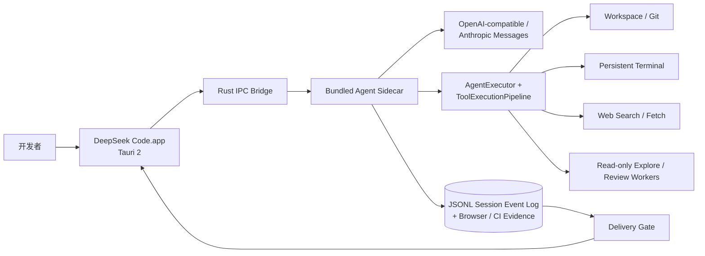
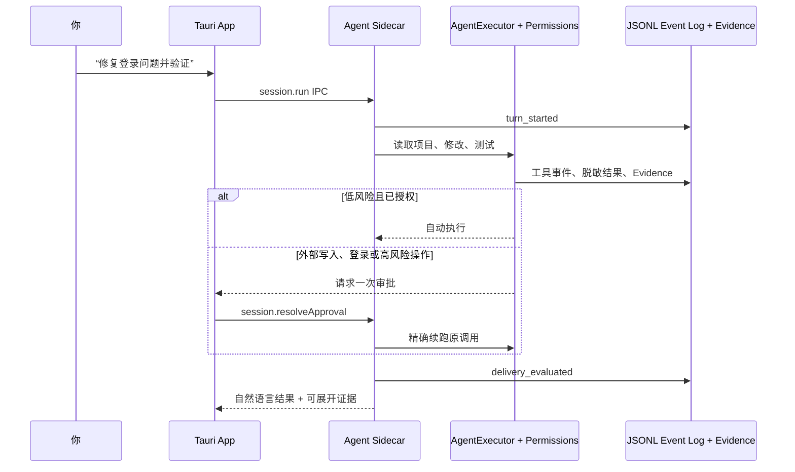
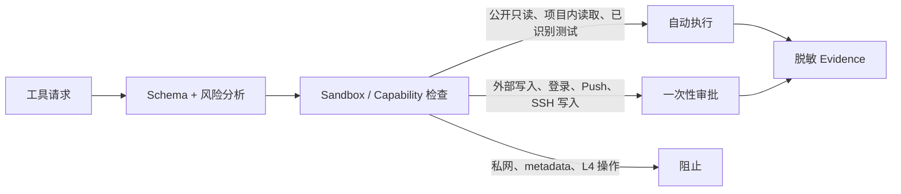

<div align="center">

# DeepSeek Code

**本地优先、原生 macOS 的编码 Agent 工作台。**

将对话、计划、工具、证据、审批与交付状态收进同一条可恢复的 Session。

[下载最新版](https://github.com/shidesheng0218/deepseek-code/releases/latest) · [快速开始](#下载使用) · [架构](#当前产品真源) · [安全与权限](#当前命令风险策略) · [开发](#本地开发)

`macOS 14+` · `Apple Silicon` · `Tauri 2` · `BYOK` · `本地优先`

</div>

> [!NOTE]
> 这是一个非官方开源项目，与 DeepSeek 无隶属关系。项目不提供产品云 Agent：模型凭据、项目文件、Session 和证据默认保留在用户的 Mac 上。

## 为什么是 DeepSeek Code？

它不是简单地把聊天框和终端并排放在一起，而是把一次任务作为可恢复、可审计的工作单元：模型回复、工具调用、权限决定、文件证据和验证结果都绑定到同一个 Session。

| 你关心的事           | DeepSeek Code 的处理方式                                |
| -------------------- | ------------------------------------------------------- |
| “帮我修这个 Bug”     | 读项目 → 修改 → 运行验证 → 汇总变更与风险               |
| “查官方文档”         | 公开只读搜索与抓取自动执行，并保存可追溯 Citation       |
| “不要一直点审批”     | 项目内读取、已识别测试和公开联网低打断；外部交付仍受控  |
| App 或 Provider 中断 | Session 事件持久化；状态未知的副作用绝不自动重放        |
| “这次到底做了什么？” | 对话保持自然，工具、证据、风险和用量可在 Inspector 展开 |



## 下载使用

### 方式一：Homebrew（推荐）

```bash
brew tap shidesheng0218/tap
brew trust shidesheng0218/tap
brew install --cask shidesheng0218/tap/deepseek-code
```

新版 Homebrew 对第三方 tap 的 Cask 要求先执行一次 `brew trust`。
通过 Homebrew 安装的应用不经过浏览器隔离（Homebrew 6 不会为 Cask 施加 quarantine 属性），安装完成后**双击即可启动，无需任何额外操作**。之后用 `brew upgrade --cask deepseek-code` 升级；`brew uninstall --cask --zap deepseek-code` 可连同会话与设置数据一起删除。App 内置的自动更新与 brew 升级二选一即可。

### 方式二：DMG 手动安装

普通用户不需要安装 Node、Swift，也不需要运行终端命令：

1. 打开 [GitHub Releases](https://github.com/shidesheng0218/deepseek-code/releases/latest)。
2. 下载 `DeepSeek-Code-<version>-arm64.dmg`。
3. 打开 DMG，把 **DeepSeek Code.app** 拖到 **Applications**，然后双击启动。
4. 首次启动如果 macOS 提示无法验证开发者，右键 App 选择“打开”，确认一次即可；这只适用于未配置 Apple Developer ID 的社区构建。

启动后默认只需配置 **Base URL、API Key 和项目目录**。DeepSeek 与其他 OpenAI-compatible 服务直接可用；使用 Anthropic 时，在设置里将协议切换为 **Anthropic Messages**。开发工具链和发布流程由项目维护者处理，用户不需要配置证书、公证或 GitHub Actions。

当前 Release 是 Apple Silicon（arm64）版本，要求 macOS 14 或更高版本。

## 当前产品真源

正式产品是 **DeepSeek Code.app**：由 **Tauri 2 + 本地 Agent Sidecar** 组成的轻量 macOS 桌面应用。`npm run dev`、构建脚本和 GitHub Release 都只启动或打包 DeepSeek Code，而不会启动 ，也不要求最终用户安装 Node、Bun 或 Swift。

- `apps/deepseek-code-desktop`：Tauri 2 桌面壳、自有 React 界面、应用权限和 DMG 打包配置。
- `apps/deepseek-agent-runtime`：随应用分发的本地 Agent Sidecar；负责会话、模型和工具协议，最终用户不需要安装 Bun。
- `macos/DeepSeekCode`：旧 SwiftUI 版本和迁移参考；在 Tauri 版完成能力迁移前保留为开发回退。
- `vendor/`：固定版本的  上游参考源码；仅用于移植经过审查的交互、工具协议、Provider/MCP/LSP 兼容与测试逻辑。
- `integrations/`：上游差异分析、许可说明与移植清单；不保存运行时凭据，也不作为用户入口。
- `src/`：更早的 Electron/React 实现，仅保留作迁移与兼容参考。

##  上游参考与复用边界

 的 `dev` 分支固定在 `vendor/`，作为 DeepSeek Code 的上游工程参考。它**不会作为 DeepSeek Code 的运行时或用户入口**，也不会以 .app 的名义启动或分发。

复用遵循“语义移植、产品自有”的边界：

- 借鉴并移植：多轮 Turn/Step、Inbox、安全的工具调用协议、Provider 与 MCP/LSP 适配语义、上下文压缩、权限体验和 E2E Fixture。
- DeepSeek Code 自行实现：Tauri 界面、Agent Sidecar、Session/Event/Evidence、Keychain、Sandbox、发布签名和 GitHub DMG。
- 不复用为运行时： Desktop、 CLI、Node/Bun Agent Loop、 用户配置或其凭据存储。
- 每次移植都保留 MIT 许可、写入 DeepSeek Code 自有测试，并且必须经过安全与 API 边界审查。

## 当前实现

- Tauri 轻量工作区：Session、Conversation、Workspace 与 Runtime 状态。
- Tauri 启动时恢复最近会话列表与已提交的用户/助手对话；工具中断不会伪装成完整回复。
- SwiftUI 旧版仍保留完整的三栏工作区，作为能力迁移和旧数据验证参考。
- 中文优先的 Session、计划、工具活动、Diff、Browser 和 Review 界面。
- Plan / Manual / Accept Edits / Auto 四种权限模式。
- 细粒度命令风险分类和审批决策。
- Sidecar 的 JSONL Session Event Log：持久化对话、工具、审批、Browser 与 CI 证据；未完成工具会被 Delivery Gate 标记为需要关注。
- OpenAI-compatible / DeepSeek-compatible Chat Completions，以及 Anthropic Messages 的流式文本、工具调用和 Token 用量解析。
- 每次模型流记录输入、缓存输入和输出 Token；价格与路由策略仍在发布硬化范围内。
- 工作区路径隔离、符号链接逃逸防护和行范围读取。
- Git Worktree 服务：创建受管理的 `deepseek/<task>` 分支与独立工作树。
- Provider 设置页：Base URL + API Key 开箱配置，并可显式选择 OpenAI-compatible / Anthropic Messages。
- API Key 由 macOS Keychain 保存；工具事件、CI 日志和子会话提示在写入模型上下文前进行脱敏。
- Agent IPC 执行闭环：模型流 → `ToolExecutionPipeline` 参数校验、风险/审批、超时与 `indeterminate` → 文件、Git、命令工具 → 脱敏事件回传。
- 文件工具支持原子 Patch、乐观哈希、检查点恢复，以及目录/符号链接工作区隔离。
- 真实本地项目选择与 Composer 任务发送入口。
- Browser Evidence 使用随 DMG 分发的 Chromium Headless Shell 与 Playwright Core；用户无需安装浏览器开发依赖。
- 独立只读 Worker 支持 Explore、Review（Git Diff）、Research（项目内证据）与 CI（工作流/构建配置）；Worker 结果必须回传主 Session，不能直接修改项目。
- MCP stdio 连接在进程退出后会重新握手、重新发现工具；收到 `tools/list_changed` 通知后，下一次调用会刷新工具目录。
- SSH 只有在项目 `.deepseek/ssh.json` 中配置 Host、远程 Tool Host 路径和 `SHA256:` Host Key 指纹后才会注册；每次远程调用前重新核对指纹，且默认需要审批。
- SSH 持久终端通过 `deepseek-host --terminal-stdio` 使用版本化 JSONL 协议，支持同一远程 Shell 状态、Attach、sequence transcript 补读；断线或结果未知时不会自动重放。
- SSH `--terminal-stdio` 只是短连接代理，远端 `--terminal-daemon` 会在代理断开后保留终端；重新连接可按原 `terminalID` Attach，关闭最后一个终端后 daemon 自动退出。
- GitHub Actions 失败日志会分类并创建独立 CI 修复会话；修复结果回流到父会话，且当前 Commit 未重新通过 CI 前 Delivery Gate 会保持 `needsRepair`。
- CI 修复会话会继承原始 Commit 与 Pull Request；回写 PR 使用独立的 `github_pr_comment` 外部写入工具，必须经过审批，Delivery Gate 在回写确认前不会显示 `delivered`。
- MCP 支持 stdio、Streamable HTTP 与 WebSocket JSON-RPC；工具目录、Resources、Prompts、`tools/list_changed` 动态刷新和输出上限都经过 Tool Pipeline，Resources/Prompts 默认按只读低打断策略处理。
- MCP HTTP 认证只接受 `authEnv` 环境变量引用（例如 `DEEPSEEK_MCP_DOCS_TOKEN`），不会把 Bearer Token、Cookie 或 API Key 从 `.mcp.json` 直接载入；401/403 会明确显示为认证失败。
- 私有 MCP 的 Bearer Token 当前使用 Streamable HTTP `authEnv`；WebSocket 适用于公开或已有会话认证的 MCP，完整 OAuth 浏览器授权与刷新仍在生态收尾范围。
- 运行中追加的第二条消息会进入同一 Session Inbox，在安全边界继续执行；事件帧复用持久 `eventID`，UI 按稳定 ID 去重，不重复渲染同一事件。
- 崩溃恢复：Sidecar 启动时扫描会话事件日志，未领取的输入会被持久恢复；存在"结果未知的写入"或"待审批"时不自动续跑，而是标记 `recovery_attention` 提示用户，未知副作用永不自动重放。
- 模型质量层：输入先经过确定性任务路由（直接问答 / 项目理解 / 代码修改 / 联网研究 / Browser 修复 / Review / CI 修复 / 交付），再生成执行决策（模型分层、响应契约、验证要求）；简单问题直接回答不调用工具，项目问题不会误触发联网；可配置独立的快速模型处理分类与短答。
- 上下文工程：进入模型的消息按预算裁剪，超长工具输出压缩为"摘要 + 已压缩 N 字符 + 完整内容保留在 Evidence"，事件日志始终保留完整证据。
- 联网研究支持 BYOK 搜索 Provider（Tavily / Brave / Exa，未配置时回退 DuckDuckGo）；结果按规范化 URL 去重、按可信度排序，每条来源带稳定 Citation ID 与 Prompt Injection 警告。
- 自动更新：Release 构建在存在签名密钥时产出 minisign 签名的 updater 包与 `latest.json`，App 内检查更新后下载安装、重启生效；密钥只保存在本地 `~/.tauri/` 或 CI Secrets，不进入仓库。
- 基准评测：`npm run bench` 用内置 mock Provider 确定性地验证路由、工具约束与交付门禁；`npm run bench:real` 使用真实 BYOK Provider 跑同题语料，`benchmarks/score.mjs` 汇总成功率、审批次数与 Token 成本，用于与 Claude Code 同题对照。
- 旧版 `DeepSeekCodeCore` 仍是 Swift 迁移参考与兼容验证工具，不是 Tauri 用户下载版的运行时。

## 一次任务如何完成



模型不能只凭一句“完成了”把任务标记为交付完成。Sidecar 根据工具、审批、CI 与验证事件决定：

```text
running → waiting_approval → completed
                       ↘ cancelled / error

Delivery Gate → delivered / handoffReady / needsRepair / needsAttention
```

### 当前运行时边界

Tauri 版目前只有一个用户运行时：**Rust IPC Bridge → Bundled Agent Sidecar**。Sidecar 串行消费同一 Session 的输入，写入 JSONL 事件，并通过同一进程协议把流式回答、审批、工具、Worker、Browser 与 CI 事件回传给界面。

`macos/DeepSeekCode` 中的 `deepseekd`、CLI、SQLite Projection 与 Runtime 3.0 架构仍保留为迁移参考和兼容测试；它们不能被描述为当前 Tauri 下载版的第二个真源。

## 本地开发

默认开发入口启动新的 DeepSeek Code Tauri 轻量桌面版：

```bash
npm run dev
```

`npm run dev:swift` 仍可启动旧 SwiftUI 版本，便于验证旧数据迁移；它不是默认产品入口。

### Tauri Sidecar CLI（共享同一个会话日志）

仓库提供一个轻量 CLI，不复制 Agent Loop，只连接当前 Bundled Sidecar：

```bash
node bin/deepseek.mjs doctor
DEEPSEEK_API_KEY=sk-... DEEPSEEK_PROJECT="$PWD" node bin/deepseek.mjs ask "解释这个登录流程"
node bin/deepseek.mjs session list
node bin/deepseek.mjs session attach <session-id>
```

它通过 `DEEPSEEK_RUNTIME_BINARY` 指向打包后的 Sidecar，默认读取仓库中的 `apps/deepseek-agent-runtime/dist/deepseek-agent-runtime`；会话仍使用与桌面 App 相同的 JSONL Event Log。可用环境变量包括 `DEEPSEEK_BASE_URL`、`DEEPSEEK_MODEL`、`DEEPSEEK_PROJECT`、`DEEPSEEK_PROTOCOL` 和 `DEEPSEEK_SESSION_ROOT`。

生成新的 Tauri macOS `.app` 和 DMG：

```bash
npm run build
```

构建产物位于 `apps/deepseek-code-desktop/src-tauri/target/release/bundle/`。打包 GitHub Release 工件：

```bash
npm run release:package
```

它会生成 `dist/DeepSeek-Code-<version>-arm64.dmg`、`SHA256SUMS.txt`、`release-metadata.json`、签名的 updater 包和 `latest.json`。当前为 ad-hoc 社区构建；Developer ID 签名和公证将在发布硬化阶段接入 Tauri 产物。

GitHub Actions 在推送 `v*.*.*` 标签时自动执行测试、Tauri DMG 打包、updater 签名包生成和 GitHub Release 上传。`TAURI_SIGNING_PRIVATE_KEY` 与 `TAURI_SIGNING_PRIVATE_KEY_PASSWORD` 只以 GitHub Secrets 保存，不要提交到仓库。Developer ID 签名与 Apple 公证是后续发布硬化的可选增强项。

本地发布工件可用以下命令验收：

```bash
npm run release:test
```

下载 GitHub Release 后，用户可校验：

```bash
shasum -a 256 -c SHA256SUMS.txt
```

## DeepSeek 接入

核心客户端使用 OpenAI-compatible Chat Completions 约定：

- Base URL：`https://api.deepseek.com/v1/` 或用户自定义兼容端点。
- API Key：仅通过 macOS Keychain/受保护 Secret Store 保存；不要写入仓库、日志、会话事件或 UI 事件。
- 主 Agent 使用高能力模型；Explore、摘要和轻量任务可路由至更快模型。
- 每个请求均应设置按功能区分的 `max_tokens`，并记录输入、缓存输入、输出 Token 与费用。

## 当前命令风险策略

| 风险 | 典型操作                                      | 默认行为                     |
| ---- | --------------------------------------------- | ---------------------------- |
| L0   | 工作区读取、公开 Web Search / Fetch、Git 状态 | 自动允许                     |
| L1   | 项目内补丁、已识别测试、Lint、构建            | Trusted Workspace 下自动执行 |
| L2   | 安装依赖、Commit、Push、外部服务写入          | 请求确认                     |
| L3   | 删除、权限变更、工作区外写入                  | 阻止或强确认                 |
| L4   | `sudo`、磁盘擦除、强制推送、破坏性递归删除    | 直接阻止                     |

### 低打断不等于越权



- 公开 HTTP/HTTPS Search 和 Fetch 默认自动，但仍记录 Citation、内容哈希和获取时间。
- localhost、私网、链路本地、metadata 地址、DNS rebinding 和危险重定向永久阻止。
- 网页内容是**不可信数据**，不能修改系统提示、权限或工具策略。
- API Key、Cookie、密码和私钥不进入模型上下文、SQLite、Transcript 或普通日志。
- Sidecar 当前仅装配有真实 Host 的能力；MCP、LSP、Browser、Terminal、Web 与 Worker 都会显式报告不可用或执行失败，不伪造成功。

## 发布硬化中的工作

- 真实 SSH Sandbox 的长期断线重连验收。
- 30 个端到端联网修复任务和 5 个 CI 修复任务基准。
- 完整 XCUITest、故障注入、签名、公证与自动更新回滚验证。
- Windows/Linux、产品云、团队账号、手机远控和无人监管系统自动化不在 1.0 范围内。

## 当前边界：已具备 vs. 正在硬化

| 已具备                                                     | 正在硬化，尚不应宣传为完成                         |
| ---------------------------------------------------------- | -------------------------------------------------- |
| Tauri App + Bundled Agent Sidecar、JSONL Event Log、审批续跑 | Browser → Test → Review → PR → CI 的真实端到端验收 |
| OpenAI-compatible / Anthropic Messages、Web、MCP stdio、LSP、Terminal、Browser Evidence | SSH 长连接与断线恢复的发布级验证                   |
| Explore / Review Worker、CI 失败分类与 CI Repair Session 回流 | 60 个真实任务与竞品同题基准                         |
| GitHub DMG 构建、Chromium + Playwright Core 随包分发        | 签名、公证、完整 XCUITest、自动更新回滚            |

`BenchmarkReleaseGate` 会检查 fixture 数量、通过率和 Evidence 覆盖率，避免不完整的本地运行被误判为发布级成绩；这**不等同于**已在同题基准上超过 Claude Code 或 Codex。

## 验证

当前测试覆盖权限策略、使用量计费、Session 事件回放、JSONL 会话事件日志、DeepSeek/OpenAI-compatible SSE、工作区隔离、Agent 审批状态机、Git Worktree 和关键 UI 交互。

建议在改动 Runtime 前至少运行：

```bash
npx vitest run tests
npm run test:sidecar
npm run lint
npm run typecheck
```

## 仓库结构

```text
.
├── macos/DeepSeekCode/
│   ├── Sources/DeepSeekCodeApp/      # SwiftUI 迁移版
│   ├── Sources/DeepSeekCodeCore/     # 迁移参考 Runtime、Provider、Pipeline
│   ├── Sources/DeepSeekCodeDaemon/   # deepseekd
│   ├── Sources/DeepSeekCodeCLI/      # deepseek CLI
│   └── Tests/                        # Core、Runtime、Harness、Daemon、Worker、CLI
├── scripts/                          # App、DMG 与 Release 验证脚本
├── .github/workflows/macos.yml       # GitHub Release workflow
└── src/                              # 历史 Electron / React 迁移参考（非正式运行时）
```

## 贡献与许可

欢迎提交 Issue、复现任务和 Pull Request。涉及 Provider 密钥、Session 数据、GitHub Token、Cookie 或私钥的内容请先脱敏，切勿提交到仓库。

本项目以 [MIT License](LICENSE) 发布。
